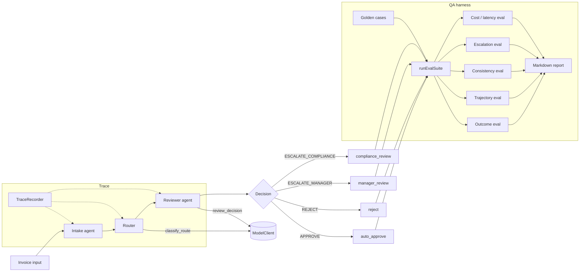

# agentic-qa-eval-harness

A small TypeScript proof-of-concept showing **how to build a QA / evaluation
harness around an agentic workflow**. The toy domain is invoice approval; the
harness is the point.

## Problem

> How do we evaluate an agentic workflow when behavior can be non-deterministic?

LLM-based agents can pass once and fail twice on the same input. A useful QA
harness therefore needs to reason about **distributions of behavior**, not
single pass/fail runs, and it needs to evaluate both **outcomes** and the
**trajectories** that produced them.

## What this repo demonstrates

- A clean **model/provider abstraction** (`ModelClient`) so the harness is
  not coupled to any specific provider.
- **Mock / replay** model layer so tests are reproducible, free, and
  CI-friendly. No paid APIs are called.
- A small **golden dataset** with explicit expected decisions, routes,
  trajectories, and risk tags.
- **Outcome** evaluation — does the final decision match expectation?
- **Trajectory** evaluation — did the workflow visit the required steps in
  order?
- **Repeated-run consistency** evaluation — does the agent agree with itself
  across N runs of the same input?
- **Cost / latency** simulation — first-class, even though the values are
  fake, because real production gates use them.
- **Escalation precision / recall** — agent behavior expressed as a binary
  classifier.
- **Traceability** — every workflow step emits a structured trace event.
- **Modular markdown agent instructions** — versioned product knowledge that
  could later be fed to real agents as prompts or tool instructions.

## Architecture



### Layout

```text
src/
  domain/                 # Invoice types + business rules (single source of truth)
  workflow/               # ModelClient + mocks + workflow runner + trace
  eval/                   # Golden cases + evaluators + report generator
  agent-instructions/     # Markdown capability modules
tests/                    # Vitest tests
reports/                  # Generated markdown reports (committed as samples)
```

## Why is the LLM mocked?

The system under test is non-deterministic by nature: a real agent calling
a real LLM will produce different traces, costs, and sometimes different
decisions across runs of the same input. **That non-determinism is the
thing the harness exists to evaluate** — via repeated runs, consistency
checks, and trajectory evaluation.

But for the harness to give *reliable* signals about that non-determinism,
the **harness itself** must be reproducible. If the eval pipeline flakes
for the same reason the agent does, you can't distinguish a real
regression from infrastructural noise.

So we mock the only non-deterministic dependency — the LLM. The mock
layer makes the harness:

- **Reproducible** — same inputs produce the same outputs (or, for the
  flaky mock, the same *distribution* of outputs given a seed).
- **CI-friendly** — no API keys, no rate limits, no flakes.
- **Free** — no per-run cost.
- **Testable** — we can validate the harness itself before pointing it
  at a real model.

`FlakyMockModelClient` then **simulates** agent non-determinism in a
controlled way — given a seed, the same flake pattern every time — so
the consistency evaluator has something realistic to catch without the
harness becoming flaky itself.

A real adapter (`OpenAIModelClient`, `AnthropicModelClient`,
`OllamaModelClient`, `InternalModelClient`) implements the same
`ModelClient` interface and slots in unchanged. In that mode, the SUT's
non-determinism is real, and the harness's repeated runs + consistency
evaluator do the load-bearing work.

## How to run

```bash
npm install
npm test                # vitest, all green
npm run typecheck       # strict TS, no emit
npm run build           # emit to dist/

npm run eval            # DeterministicMockModelClient → reports/baseline-report.md
npm run eval:flaky      # FlakyMockModelClient        → reports/flaky-report.md
```

Both eval commands print a one-screen summary to stdout and write a
markdown report to `reports/`.

## Example report snippet

```markdown
# Eval Report — Flaky mode

**Model client**: `FlakyMockModelClient`
**Runs per case**: 5
**Total cases**: 10
**Total runs**: 50

## Summary
| Metric | Value |
|---|---|
| outcome_pass_rate | 78.00% |
| trajectory_pass_rate | 100.00% |
| consistency_rate | 40.00% |
| escalation_precision | 0.83 |
| escalation_recall | 0.78 |
| unstable_cases | `gc-001-low-risk-approve`, `gc-006-high-amount-and-high-risk` |
```

## Agent instruction modules

`src/agent-instructions/*.md` are intentionally simple capability modules.
They document intake, routing, and review policy as **versioned product
knowledge**. They could later be loaded as prompts, tool descriptions, or
retrieval documents for a real agent. They are deliberately plain markdown
and depend on no skill framework — the QA harness is the focus, not any
particular agent runtime.

## How this would evolve in production

- **Real model adapters** alongside the mock: OpenAI, Anthropic, Ollama, an
  internal gateway.
- **Production traces become regression cases** — every novel decision the
  live agent makes can be replayed offline.
- A **human-labeled calibration set** to anchor LLM-as-judge confidence.
- **LLM-as-judge** *only* for subjective cases (e.g. justification quality);
  deterministic checks first.
- **CI quality gates**: fail the build if `outcome_pass_rate` or
  `consistency_rate` regress beyond a threshold.
- **Dashboarding**: track the same metrics as time series, not just per-PR.
- **Versioning** of prompts, tool definitions, model snapshots, and these
  instruction files — bind them to commit SHAs in the trace.
- **Privacy / security**: redact PII before traces leave the environment;
  keep a deny-list of prompt content the harness must never log.
- **ROI metrics**: deflection rate, time-to-decision, reviewer-hours saved.
- **Browser checks** with Playwright if the agent interacts with a UI —
  golden flows of the actual user journey.

## Demo talking points

- **Quality is a property of the system, not just the agent.** Tools, prompts,
  routing, retries, and rule layers all affect outcomes; evaluate the whole.
- **Deterministic checks first, LLM judges only where needed.** Cheaper,
  faster, lower variance. Reach for a model judge when no rule fits.
- **Evaluate outcomes *and* trajectories.** A correct answer reached by a
  broken path is a latent regression.
- **Reason in distributions.** A 5/5 pass tells you very different things at
  N=1, N=5, and N=50. Repeats are mandatory for non-deterministic systems.
- **Cost and reliability are first-class quality metrics.** A correct agent
  that costs $5 per request is not production-ready.
- **The harness must itself be reproducible.** That is why the model layer
  is mocked here — to test the test infrastructure.

## A note about `AGENTS.md` and `CLAUDE.md`

The repo includes `AGENTS.md` and `CLAUDE.md` to document how AI coding
agents should work with this codebase — coding standards, testing
expectations, and what *not* to add. They are included to demonstrate
disciplined AI-augmented development, not because they are the focus of the
PoC. The focus remains the QA / evaluation harness.

## License

Released under the MIT License — see [LICENSE](LICENSE).
