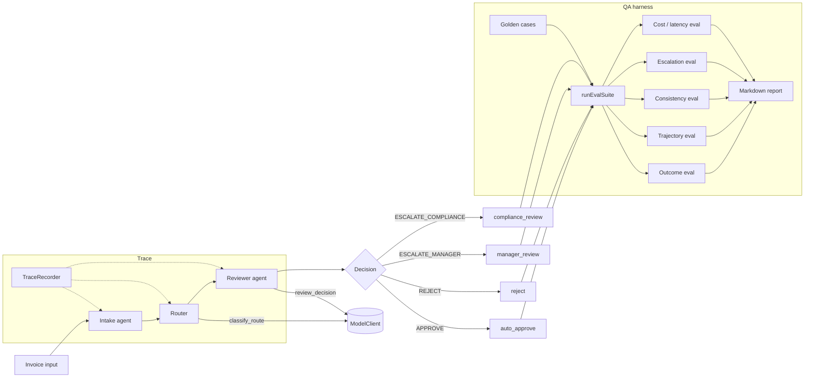

# agentic-qa-eval-harness

A small TypeScript proof-of-concept showing **how to build a QA / evaluation
harness around an agentic workflow**. The toy domain is invoice approval; the
harness is the point.

## Problem

> How do we evaluate an agentic workflow when behavior can be non-deterministic?

LLM-based agents can pass once and fail twice on the same input. A useful QA
harness therefore needs to reason about **distributions of behavior**, not
single pass/fail runs, and it needs to evaluate both **outcomes** and the
**trajectories** that produced them.

## What this repo demonstrates

Grouped by the concern each piece serves, not by feature:

- **Evaluation surface.** Five evaluators that each answer a different
  question: outcome (did we get the right decision?), trajectory (did we
  get there the right way?), consistency (does the agent agree with itself
  across N runs?), escalation as a binary classifier (precision/recall),
  and cost/latency aggregated with p95.
- **Determinism where it matters.** A `ModelClient` seam decouples the
  workflow from any provider. Two mocks live behind it — a deterministic
  baseline and a seeded flaky one — so the harness is reproducible while
  the agent it evaluates is not.
- **Traceability.** Every workflow step emits a structured event with
  cost, latency, and metadata. Trajectory and cost evaluators reason over
  that trace; the metadata can be asserted on directly.
- **Production mapping.** A small golden dataset with risk tags, a
  fail-closed edge case, and a markdown report whose schema would slot
  into a CI quality gate or a dashboard without much change.
- **Versioned agent knowledge.** Intake/routing/review policy lives as
  plain markdown — capability modules that a real agent could later load
  as prompts, tool descriptions, or retrieval documents, without coupling
  the harness to any agent framework.

## Architecture

The three workflow stages (intake → routing → review) sit on the left,
share a `TraceRecorder`, and feed each run into the QA harness on the
right. The model client is the seam where a real provider could replace
the mock; the rest of the diagram is unchanged.



### Layout

```text
src/
  domain/                 # Invoice types + business rules (single source of truth)
  workflow/               # ModelClient + mocks + workflow runner + trace
  eval/                   # Golden cases + evaluators + report generator
  agent-instructions/     # Markdown capability modules
tests/                    # Vitest tests
reports/                  # Generated markdown reports (committed as samples)
```

## Why is the LLM mocked?

The system under test is non-deterministic by nature: a real agent calling
a real LLM will produce different traces, costs, and sometimes different
decisions across runs of the same input. **That non-determinism is the
thing the harness exists to evaluate** — via repeated runs, consistency
checks, and trajectory evaluation.

But for the harness to give *reliable* signals about that non-determinism,
the **harness itself** must be reproducible. If the eval pipeline flakes
for the same reason the agent does, you can't distinguish a real
regression from infrastructural noise.

So we mock the only non-deterministic dependency — the LLM. The mock
layer makes the harness:

- **Reproducible** — same inputs produce the same outputs (or, for the
  flaky mock, the same *distribution* of outputs given a seed).
- **CI-friendly** — no API keys, no rate limits, no flakes.
- **Free** — no per-run cost.
- **Testable** — we can validate the harness itself before pointing it
  at a real model.

`FlakyMockModelClient` then **simulates** agent non-determinism in a
controlled way — given a seed, the same flake pattern every time — so
the consistency evaluator has something realistic to catch without the
harness becoming flaky itself.

A real adapter (`OpenAIModelClient`, `AnthropicModelClient`,
`OllamaModelClient`, `InternalModelClient`) implements the same
`ModelClient` interface and slots in unchanged. In that mode, the SUT's
non-determinism is real, and the harness's repeated runs + consistency
evaluator do the load-bearing work.

## How to run

Requires Node 22+.

```bash
npm install
npm test                # vitest, all green
npm run typecheck       # strict TS, no emit
npm run build           # emit to dist/

npm run eval            # DeterministicMockModelClient → reports/baseline-report.md
npm run eval:flaky      # FlakyMockModelClient        → reports/flaky-report.md
```

Both eval commands print a one-screen summary to stdout and write a
markdown report to `reports/`.

## Example report snippet

Real numbers from the current [`reports/flaky-report.md`](reports/flaky-report.md)
(seed 42, failureRate 0.25, 5 runs/case):

```markdown
# Eval Report — Flaky mode

**Model client**: `FlakyMockModelClient`
**Runs per case**: 5
**Total cases**: 10
**Total runs**: 50

## Summary
| Metric | Value |
|---|---|
| outcome_pass_rate     | 84.00% |
| trajectory_pass_rate  | 98.00% |
| consistency_rate      | 30.00% |
| escalation_precision  | 0.7778 |
| escalation_recall     | 0.9333 |
| unstable_cases        | 7 of 10 |
```

The 98% trajectory pass rate (vs 84% outcome) is the metadata-aware
trajectory check earning its keep: on `gc-006` one attempt's *router*
proposed the wrong route even though the reviewer corrected the final
decision — a wrong-path-right-answer the outcome evaluator alone misses.

## Agent instruction modules

`src/agent-instructions/*.md` are intentionally simple capability modules.
They document intake, routing, and review policy as **versioned product
knowledge**. They could later be loaded as prompts, tool descriptions, or
retrieval documents for a real agent. They are deliberately plain markdown
and depend on no skill framework — the QA harness is the focus, not any
particular agent runtime.

## How this would evolve in production

- **Real model adapters** alongside the mock — same `ModelClient`
  interface, no other code changes — pointed at OpenAI, Anthropic, an
  on-prem Ollama, or an internal gateway.
- **Production traces become regression cases.** Every novel decision the
  live agent makes is a replayable input for the next eval run.
- **LLM-as-judge for subjective slices only** (e.g. justification quality),
  anchored against a small human-labeled calibration set. Deterministic
  checks first; model judges where no rule fits.
- **CI quality gates** that fail the build when `outcome_pass_rate` or
  `consistency_rate` regress past a threshold — the markdown report's
  schema already supports this.
- **Versioning** of prompts, tool definitions, model snapshots, and the
  instruction modules — bind each to a commit SHA in the trace so a
  regression can be traced to the exact stack that produced it.
- **Privacy and ROI.** Redact PII before traces leave the environment;
  track business signals like deflection rate, time-to-decision, and
  reviewer-hours saved alongside the technical metrics.

## Design principles

- **Quality is a property of the system, not just the agent.** Tools, prompts,
  routing, retries, and rule layers all affect outcomes; evaluate the whole.
- **Deterministic checks first, LLM judges only where needed.** Cheaper,
  faster, lower variance. Reach for a model judge when no rule fits.
- **Evaluate outcomes *and* trajectories.** A correct answer reached by a
  broken path is a latent regression.
- **Reason in distributions.** A 5/5 pass tells you very different things at
  N=1, N=5, and N=50. Repeats are mandatory for non-deterministic systems.
- **Cost and reliability are first-class quality metrics.** A correct agent
  that costs $5 per request is not production-ready.
- **The harness must itself be reproducible.** That is why the model layer
  is mocked here — to test the test infrastructure.

## A note about `AGENTS.md` and `CLAUDE.md`

`AGENTS.md` documents how AI coding agents should work on this repo
(commands, constraints, what *not* to add). `CLAUDE.md` is a pointer to
it. They are guardrails, not the focus of the PoC.

## License

Released under the MIT License — see [LICENSE](LICENSE).
